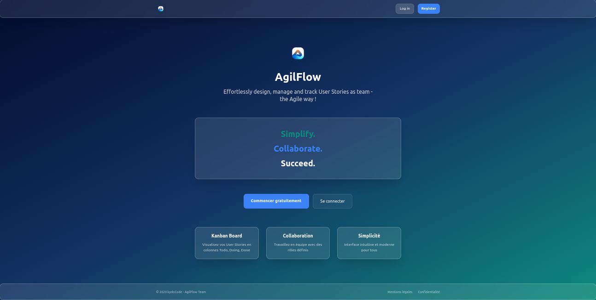
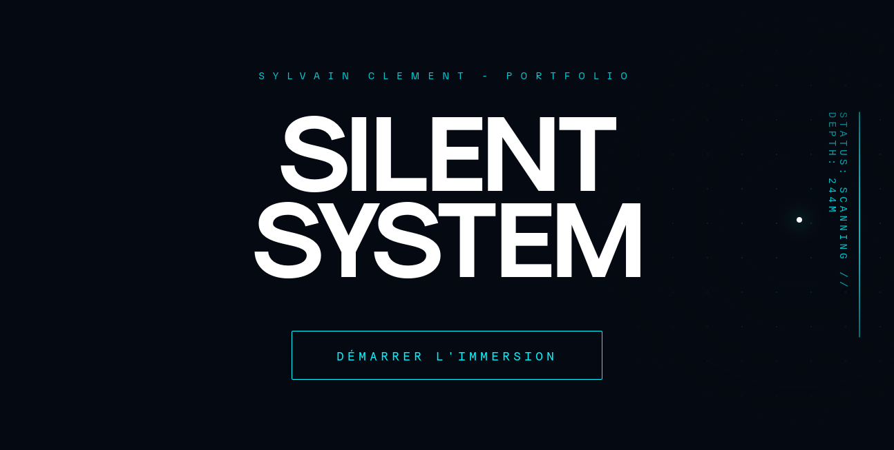

  <a href="README.md">English</a> | <a href="README_fr.md">Français</a> | <a href="README_de.md">Deutsch</a> | <a href="README_zh.md">中文</a>

<h1 align="center">
  
</h1>

<h1 align="center">Kydo Code</h1>

  

## 关于我
你好！
我是 **Kydo**，一名对编程、**QA 工程**和数字创作充满热情的开发人员兼 **UI 设计师**。专注于构建安全、高性能的应用，注重用户体验和软件完整性。

---

## 我的技能

### 创意技术栈与 UI 设计 (CDUI)

  
  
  
  
  
  
  
  
  

 

### 编程语言、框架与类库

  
  
  
  
  
  
  
  
  
  
  
  
  

 

### 内容管理系统 (CMS)

  
  

 

### 数据库、质量保证 (QA) 与 版本控制工具

  
  
  
  
  
  

---

## 当前重点
* **Agilflow 2026** : 开发高端全栈应用。
  * [前端 (React)](https://github.com/kydoCode/agilflow-react-2026) | [后端 (Node)](https://github.com/kydoCode/agilflow-api-2026)
* **LMS 与自动化** : 在低代码平台上开发 Python 工具和 LMS 模块。
* **SEO 策略** : 深入研究搜索引擎优化和性能。

---

## 项目展厅

  <a href="https://github.com/kydoCode/agilflow-react-2026"><b>AgilFlow 2026</b></a> •
  <a href="https://github.com/kydoCode/portfolio-front-2026"><b>Portfolio 2026</b></a> •
  <a href="https://github.com/kydoCode/Home-Key-v2"><b>Home Key</b></a> • 
  <a href="https://github.com/kydoCode/hagile_clone"><b>Hagile</b></a>

---

## 精选项目
  

  <a href="https://github.com/kydoCode/agilflow-react-2026">
    <svg width="600" height="18" viewBox="0 0 600 18" fill="none" xmlns="http://www.w3.org/2000/svg" style="display: block; margin: 0 auto;">
      <rect width="600" height="18" rx="8" fill="#2D333B"/>
      <circle cx="12" cy="9" r="3" fill="#FF5F56"/>
      <circle cx="24" cy="9" r="3" fill="#FFBD2E"/>
      <circle cx="36" cy="9" r="3" fill="#27C93F"/>
    </svg>
  </a>

  <a href="https://github.com/kydoCode/portfolio-front-2026">
    <svg width="600" height="18" viewBox="0 0 600 18" fill="none" xmlns="http://www.w3.org/2000/svg" style="display: block; margin: 0 auto;">
      <rect width="600" height="18" rx="8" fill="#2D333B"/>
      <circle cx="12" cy="9" r="3" fill="#FF5F56"/>
      <circle cx="24" cy="9" r="3" fill="#FFBD2E"/>
      <circle cx="36" cy="9" r="3" fill="#27C93F"/>
    </svg>
  </a>

---

## 活动与影响力

  

<!-- 

  

 -->

<i>别忘了为你感兴趣的项目点星！</i>

---

## 联系方式

  <a href="https://www.sylvainclement.dev/" target="_blank"><b>个人网站 / 作品集</b></a>

---

## 治理与安全
> **3-2-1 标准：** 应用专业备份策略（本地、离线、云端）。  
> **权威：** 所有提交均经过 **GPG 签名**，以确保代码完整性和真实性。

  

